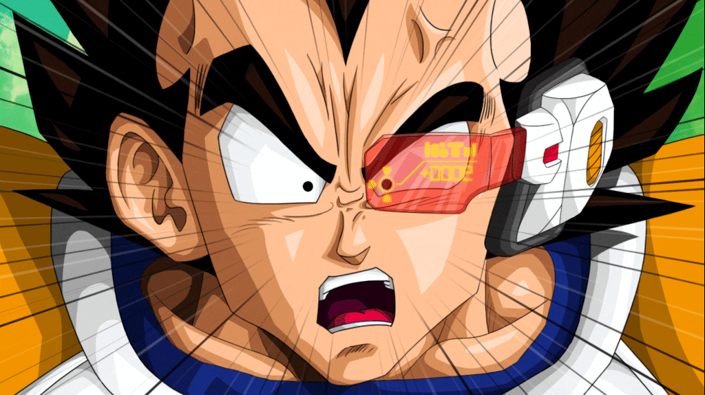

## Vorschau: Over 9000 Szene



*Erste Szene aus der Over 9000 Animation*

# Vegeta_AttaSCII

## Extra Story: IT'S OVER 9000!!!

Erlebe die legendäre Szene aus Dragon Ball Z als animierte Terminal-Story!

**Ablauf:**
- Vegeta scannt Son Gokus Powerlevel mit dem Scouter
- Die Energie steigt rasant an
- Vegeta ruft: "IT'S OVER 9000!!!"
- Der Scouter explodiert – Finale!

**Starten:**
```sh
./vegeta_over9000.sh [SCALE]
```
Optional: `[SCALE]` ist ein Wert zwischen 0.3 und 1.0 für kleine oder große Terminals (z.B. `./vegeta_over9000.sh 0.5`).

**Voraussetzungen:**
- jp2a (für ASCII-Bilder)
- ffmpeg (für Bildkonvertierung, falls noch nicht geschehen)

Viel Spaß beim Powerlevel-Check!
