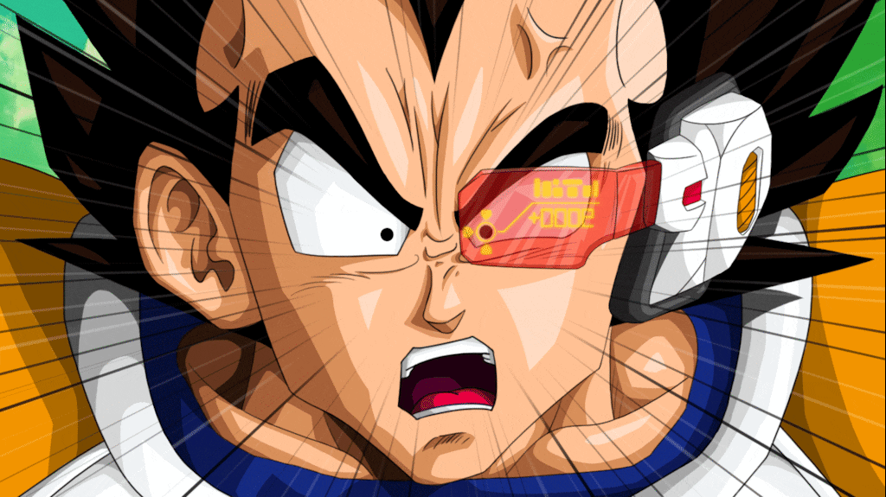

## Vorschau: Over 9000 Szene



*Erste Szene aus der Over 9000 Animation*

# Vegeta_AttaSCII

## Extra Story: IT'S OVER 9000!!!

Erlebe die legendäre Szene aus Dragon Ball Z als animierte Terminal-Story!

**Ablauf:**
- Vegeta scannt Son Gokus Powerlevel mit dem Scouter
- Die Energie steigt rasant an
- Vegeta ruft: "IT'S OVER 9000!!!"
- Der Scouter explodiert – Finale!

**Starten:**
```sh
./vegeta_over9000.sh [SCALE]
```
Optional: `[SCALE]` ist ein Wert zwischen 0.3 und 1.0 für kleine oder große Terminals (z.B. `./vegeta_over9000.sh 0.5`).

**Voraussetzungen:**
- jp2a (für ASCII-Bilder)
- ffmpeg (für Bildkonvertierung, falls noch nicht geschehen)

Viel Spaß beim Powerlevel-Check!

## Plain-ASCII-Export (ohne Farben)

Für Ausgaben, in denen ANSI-Farben nicht funktionieren (Chat, Markdown-Code-Fences, Logs), exportiert `ascii_export.py` die Bilder als farblose `.txt` nach `ascii/`:

```sh
python3 ascii_export.py              # alle Szenen
python3 ascii_export.py vegeta ssj1  # nur bestimmte Szenen
python3 ascii_export.py --width 80   # schmaler
```

Szenen: `over9000`, `vegeta`, `ssj1`, `final_flash`, `explosion` sowie die Reihe **Life of Vegeta** (`01_planet_vegeta` … `14_final_explosion`, Kindheit bis Majin-Saga) nach `ascii/life_of_vegeta/`. `python3 ascii_export.py --list` zeigt alle. Zuschnitt, Höhe, Gamma und Freistellen pro Bild stehen in `SCENES` im Skript; die Vorlagen der Life-of-Vegeta-Reihe sind urheberrechtlich geschützt und nicht im Repo - `python3 fetch_images.py` lädt sie anhand von `images/life_of_vegeta/SOURCES.md` aus dem Dragon Ball Wiki.

**Voraussetzung:** Python 3 + Pillow (`pip install pillow`). Für Szenen mit `cut=True` zusätzlich [rembg](https://github.com/danielgatis/rembg) (lädt beim ersten Lauf das Modell `isnet-anime`, ~176 MB), am besten in einem venv:

```sh
python3 -m venv .venv && .venv/bin/pip install "rembg[cpu]" pillow
.venv/bin/python ascii_export.py
```

Ohne rembg wird ohne Freistellen exportiert.
